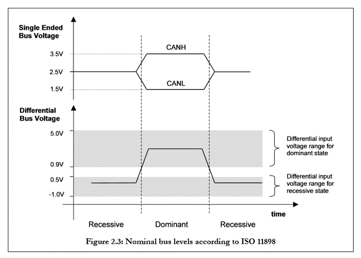
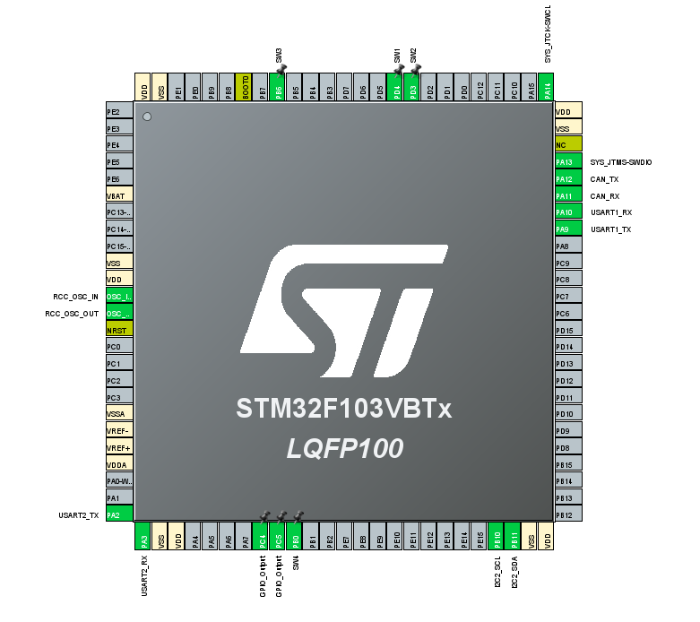

# can总线实验

本实验实现了两块HEXBOT STM32主板之间的CAN通信。

前往[Github](https://github.com/H3XBOT/STM32F103-Code/tree/main/CAN%E9%80%9A%E4%BF%A1)下载本实验代码。

 

## can总线简介

CAN是控制器局域网络(Controller Area Network, CAN)的简称，是由以研发和生产汽车电子产品著称的德国BOSCH公司开发的，并最终成为国际标准（ISO 11898），是国际上应用最广泛的现场总线之一。 在北美和西欧，CAN总线协议已经成为汽车计算机控制系统和嵌入式工业控制局域网的标准总线，并且拥有以CAN为底层协议专为大型货车和重工机械车辆设计的J1939协议。

它的通信速度较快，通信距离远，最高1Mbps（距离小于40米），最远可达10千里（速率低于5Kbps）。

一次最多只能发送8个字节的数据，这是由CAN协议规定的。
多于8个的需要第二次再发送，或者做一个上层的连续多数据发送的函数。

本次实验则是将can总线用于板间通信，在定时器的基础上，通过can总线实现一个开发板上的按键，对另一个开发板所连oled屏幕的控制。

## can总线工作原理

本次实验使用用的TJA1050采用的是ISO 11898标准。

从该标准可以看出，显性电平对应逻辑0，CAN_H和CAN_L之差为2.5V左右。而隐性电平对应逻辑1，CAN_H和CAN_L之差为0V。在总线上显性电平具有优先权，只要有一个单元输出显性电平，总线上即为显性电平。而隐形电平则具有包容的意味，只有所有的单元都输出隐性电平，总线上才为隐性电平（显性电平比隐性电平更强）。另外，在CAN总线的起止端都有一个120Ω的终端电阻，来做阻抗匹配，以减少回波反射。

## 软件设计

### can总线发送的部分

CAN协议是通过以下5种类型的帧进行的：
>数据帧  
>摇控帧  
>错误帧  
>过载帧  
>帧间隔  

另外，数据帧和遥控帧有标准格式和扩展格式两种格式。标准格式有11 个位的标识符（ID），扩展格式有29 个位的ID。  
因为本实验是基于数据帧的，下面简要介绍一下数据帧。

数据帧一般由7个段构成，即：  
>帧起始。表示数据帧开始的段。  
>仲裁段。表示该帧优先级的段。  
>控制段。表示数据的字节数及保留位的段。  
>数据段。数据的内容，一帧可发送0~8个字节的数据。  
>CRC段。检查帧的传输错误的段。  
>ACK段。表示确认正常接收的段。  
>帧结束。表示数据帧结束的段。  

我们在实现程序代码时就要对这些段分别进行设置，以达到发送和接收的目的。
本实验是在时钟的基础上完成的，开启了can总线，采用默认的PA11和PA12进行收发，为了方便得到串口信息，也开启了usart1和usart2。CubeMX设置设置如下：

之后要进行usart和can的NVIC设置。

usart使用默认参数即可，对can要进行参数设置来修改can总线的波特率：

下面是对can协议进行处理的代码：

我们需要在main.c里面加入相关头文件，然后还需要使用一些函数来完成初始化。

循环部分不需要修改。

但对于mode_check()需要进行一些改变以实现板间通信：

以上就是所有的代码部分，编写完成后下载到两块HEXBot主板里面。  
可以利用keyboard拓展板上的按键进行控制。

## 实验现象

按下按键后

